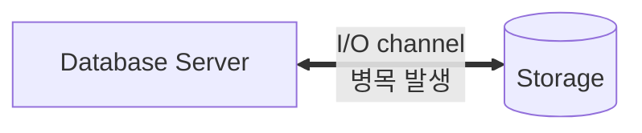
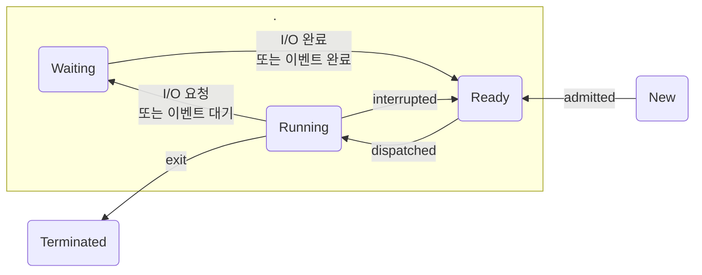

- I/O 튜닝이 곧 SQL 튜닝이다.
    - SQL이 느린 이유는 디스크 I/O때문이다
    - I/O = 잠 (SLEEP)

### SQL이 느린 이유

- 십중팔구 **디스크 I/O(=잠)** 가 원인이다.
    - OS 또는 I/O 서브 시스템이 I/O를 처리하는 동안 프로레스는 잠을 자기 때문

### 프로세스
- 실행중인 프로그램
#### 프로세스 생명주기

- new → ( ready → running → waiting )반복 → terminated
    - 실행중인 프로세스는 interrupt에 의해 수시로 실행 준비 상태 ( Runnable Queue )로 전환했다가 다시 실행 상태로 전환한다.
    - 여러 프로세스가 하나의 CPU를 공유할 수 있지만, 특정 순간에는 하나의 프로세스만 CPU를 사용할 수 있기 때문에 이러한 메커니즘이 활용된다.
- 디스크에서 데이터를 읽어야 할 땐 CPU를 OS에 반환하고 잠시 수면(Waiting) 상태에서 I/O가 완료되기를 기다린다. 
    - 정해진 OS함수를 호출(I/O Call)하고 CPU를 반환한 채 알람을 설정하고 대기 큐(Wait Queue)에서 잠을 자는것이다.

⇒ I/O가 많으면 성능이 느릴수 밖에 없다.

## 데이터베이스 저장 구조

### 용어 설명
구분 | 설명
:--:|--
테이블 스페이스 | 세그먼트를 담는 콘테이너, 여러개의 데이터파일로 구성
데이터 파일 | 디스크 상의 물리적인 OS파일
세그먼트 | 데이터 저장공간이 필요한 오브젝트( 테이블, 인덱스, 파티션, LOB(Large OBject) 등 )   여러 개의 익스텐트로 구성
익스텐트 | 공간을 확장하는 단위, 연록된 블록들의 집합
블록 | 실제로 데이터를 저장하는 공간, 데이터를 읽고 쓰는 단위

- 테이블, 인덱스를 생성할 때 데이터를 어떤 테이블 스페이스에 저장할지를 지정한다.
- 파티션 구조가 아니라면, 테이블/인덱스는 각각 하나의 세그먼트이다.
- 파티션 구조라면 각 파티션이 하나의 세그먼트가 된다
- LOB컬럼은 그 자체가 하나의 세그먼트를 구성하므로, 자신이 속한 테이블과는 다른 별도 공간에 값을 저장한다.
- 테이블이나 인덱스에 데이터를 입력하다가 공간이 부족해지면 해당 오브젝트가 속한 테이블스페이스로 부터 익스텐트를 추가로 할당 받는다.

#### 블록
- 사용자가 입력한 레코드를 실제로 저장하는 공간
    - 페이지 라고도 부름 ( DB2, SQL Server )
- 한 블록은 한 테이블이 독점한다 → 한 블록에 저장된 레코드는 모두 같은 테이블 레코드다.
    - 다중 테이블 클러스터 일 때는 한 블록에 여러 테이블 레코드가 같이 저장될 수 있다.
- 한 익스텐트도 하나의 테이블이 독점한다. (SQL Server는 여러 오브젝트가 한 익스텐트를 같이 사용하기도 한다.)
- 익스텐트 내 블록은 서로 인접한 연속된 공간이나 익스텐트끼리는 연속된 공간이 아니다.

#### 그외
- 세그먼트에 할당된 모든 익스텐트가 같은 데이터 파일에 위치하지 않을 수 있다.
- 하나의 테이블 스페이스를 여러 데이터 파일로 구성하면, 파일 경합을 줄이기 위해 가능한 한 여러 데이터 파일로 분산해서 저장한다.

#### DBA ( Data Block Address )
- 데이터 블록 자신만의 고유 주소값 
    - 디스크 상에서 몇 번 데이터 파일의 몇 번째 블록인지를 나타낸다.
    - 블록은 데이터를 읽고 쓰는 단위이므로, 모든 연산에서 DBA를 확인한다.
- 인덱스를 이용해 테이블 레코드를 읽을 때는 인덱스 ROWID를 이용한다.
    - ROWID 는 DBA + 로우번호(블록 내 순번)으로 구성되어 있다.
- 테이블 스캔 시
    - 테이블 세그먼트 헤더에 저장된 익스텐트 맵을 이용한다.
        - 각 익스텐트의 첫 번째 블록 DBA를 알 수 있다.
        - 익스텐트는 연속된 블록 집합이므로, 테이블을 스캔할 때는 첫번째 블록 뒤에 연속해서 저장된 블록을 읽을 수 있다.

#### 친절한 SQL 튜닝 1
