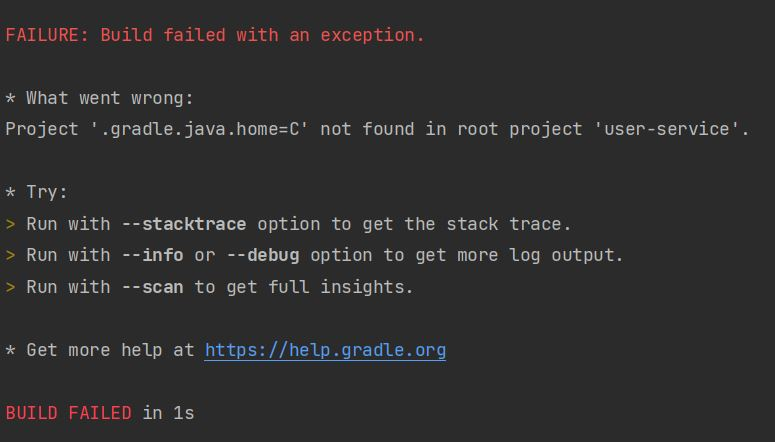

# 쓰면서 알아가는 Gradle

## Gradle과 Gradel Wrapper 의 차이는?

### gradle을 이용한 부팅 명령어
```bash
 ./gradlew bootRun --args='--server.port={{portNum}}'
```
- --args를 이용해서 옵션값을 전달할 수 있다.

### gradle을 이용한 빌드 명령어
```bash
./gradlew build
```
> ✅참고
> build 된 jar 파일을 실행하는 자바 명령어는?  
> ```
> java -jar -Dserver.port={{portNum}} {{build된 jar 파일 디렉토리/build된 jar 파일명}}.jar
> ```
> 참고) https://recordsoflife.tistory.com/325


### JDK 버전 변경이 필요한 경우
1. src 디렉토리 아래에 gradle.properties 파일을 만들어서 gradle의 JAVA_HOME을 지정해준다.
2. build 수행시 java_home을 수동으로 지정한다.
   ```bash
    ./gradlew build -Dorg.gradle.java.home=/JDK_PATH
   ```
   - 그런데, 윈도우 디렉토리 값을 전달할 때, C 이하의 값을 읽지 못하는 이슈가 존재한다.
   - 아무리 검색해봐도 왜 안 되는지 모르겠다. 싱글쿼트, 더블쿼트, 이스케이프 문자 적용 등 가능한 방식은 다 시도해본 것 같다. 해당 gradle 버전에서 이런 이슈가 존재할까??
   
      - 일단 gradle.properties를 적용하는 것으로 마무리했다.
  

참고) 
- https://velog.io/@franc/Gradle-%EA%B8%B0%EB%B3%B8%EC%82%AC%EC%9A%A9%EB%B2%95
- https://ivvve.github.io/2019/07/12/java/ETC/different-jdk-build/
- http://daplus.net/java-gradle%EC%97%90-%ED%8A%B9%EC%A0%95-jdk-%EB%B2%84%EC%A0%84%EC%9D%84-%EC%82%AC%EC%9A%A9%ED%95%98%EB%8F%84%EB%A1%9D%ED%95%98%EB%A0%A4%EB%A9%B4-%EC%96%B4%EB%96%BB%EA%B2%8C%ED%95%B4%EC%95%BC/