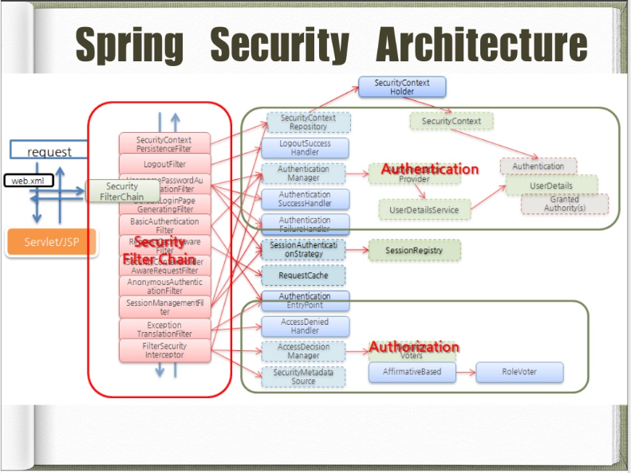

# Spring Security

- 스프링 시큐리티는 스프링 기반의 어플리케이션의 보안(인증과 권한)을 담당하는 프레임워크를 말한다.
    - 스프링 시큐리티(Spring Security)를 사용하면 편리하게 인증/인가를 구현할 수 있다.
    - 만약 스프링 시큐리티를 사용하지 않았다면, 자체적으로 세션을 체크하고 리다이렉트 등을 해야 할 것이다.    
- 스프링 시큐리티는 보안과 관련해서 체계적으로 많은 옵션들을 지원해준다.
- 스프링 시큐리티는 **필터(Filter) 기반으로 동작**하기 때문에 **스프링 MVC 와 분리되어 관리 및 동작**한다.
- 스프링 시큐리티 3.2부터는 XML로 설정하지 않고 자바 config 설정으로 간단하게 설정할 수 있도록 지원하고 있다.

### 자주 사용하는 보안 용어

- **접근 주체(Principal)** :보호된 대상에 접근하는 **유저**
- **인증(Authentication)** : 인증은 '증명하다' 라는 의미로, 유저가 아이디와 비밀번호를 이용하여 로그인하는 과정을 말한다.
- **인가(Authorization)** : '권한부여' 나 '허가' 와 같은 의미로 사용한다. 즉, 어떤 대상이 특정 자원에 접근하는 등의 목적을 실현하도록 허용(Access) 하는 것을 의미한다. 
  - 예를 들어, 로그인을 했다 하더라도 어느정도 이상의 등급이 되지 않을 경우, 즉 인가되지 않은 경우 특정 서비스는 이용을 못하기도 한다.
- **권한** : 인증된 주체가 애플리케이션의 동작을 수행할 수 있도록 허락되었는지를 결정할 때 사용한다. 

---
## 스프링 시큐리티 필터(Spring Security Filter)

- MVC 구조에서 클라이언트(보통 브라우저)가 요청을 보내면, 그 요청을 서블릿이나 JSP 등이 처리하게 된다.
- **스프링 MVC에서는 요청을 가장 먼저 받는 것이 DispatcherServlet**이다. 이 DispatcherServlet이 요청 받기 전에 다양한 필터들이 있을 수 있다.
  - 필터의 역할은 클라이언트와 자원 사이에서 요청과 응답 정보를 이용해 다양한 처리를 하는데 목적이 있다.
  - 필터는 요청을 받은 후, 클라이언트가 원래 요청한 자원이 아닌 다른 자원으로 리다이렉트 시킬 수도 있다.
  - 필터는 다음 필터에게 요청과 응답을 전달하지 않고, 바로 클라이언트에게 응답하고 끝낼 수도 있다.

### Security Filter Chain(시큐리티 필터 체인)
- 스프링 시큐리티는 다양한 기능을 가진 필터들을 10개 이상 기본적으로 제공한다. 
- 이러한 필터들을 **Security Filter Chain(시큐리티 필터 체인)** 이라고 말한다.

- 위 이미지는 **시큐리티 필터 체인과 각각의 필터에서 사용하는 객체들(Repository, Handler, Manager 등)을 구조화한 이미지**이다.
  - 추가 이미지 참고) [https://atin.tistory.com/590](https://atin.tistory.com/590)

### 각 필터 filter의 역할
- SecurityContextPersistenceFilter : SecurityContextRepository에서 SecurityContext를 가져오거나 저장하는 역할을 한다.
- LogoutFilter : 설정된 로그아웃 URL로 오는 요청을 감시하며, 해당 유저를 로그아웃 처리한다.
- **UsernamePasswordAuthenticationFilter** : (아이디와 비밀번호 기반 인증) 설정된 로그인 URL로 오는 요청을 감시하며, 유저 인증을 처리한다.
    1. AuthenticationManager를 통한 인증 실행
    2. 인증 성공 시, 얻은 `Authentication` 객체를 `SecurityContext`에 저장 후 `AuthenticationSuccessHandler` 실행
    3. 인증 실패 시, `AuthenticationFailureHandler` 실행
- DefaultLoginPageGeneratingFilter : 인증을 위한 로그인 폼 URL을 감시한다.
- BasicAuthenticationFilter : HTTP 기본 인증 헤더를 감시하여 처리한다.
- RequestCacheAwareFilter : 로그인 성공 후, 원래 요청 정보를 재구성하기 위해 사용된다.
- SecurityContextHolderAwareRequestFilter : HttpServletRequestWrapper 를 상속한 SecurityContextHolderAwareRequestWapper 클래스로 HttpServletRequest 정보를 감싼다. SecurityContextHolderAwareRequestWrapper 클래스는 필터 체인상의 다음 필터들에게 부가 정보를 제공한다.
- AnonymousAuthenticationFilter : 이 필터가 호출되는 시점까지 사용자 정보가 인증되지 않았다면 인증 토큰에 사용자가 익명 사용자로 나타난다.
- SessionManagementFilter : 이 필터는 인증된 사용자와 관련된 모든 세션을 추적한다.
- ExceptionTranslationFilter : 이 필터는 보호된 요청을 처리하는 중에 발생할 수 있는 예외를 위임하거나 전달하는 역할을 한다.
- FilterSecurityInterceptor : 이 필터는 AccessDecisionManager 로 권한 부여 처리를 위임함으로써 접근 제어 결정을 쉽게 해준다.

## 스프링 시큐리티 인증 관련 아키텍처

1. 유저가 로그인을 시도한다. 아이디와 암호를 입력했을 때 이를 처리하는 필터는 `AuthenticationFilter` 이다.
2. AuthenticationFilter는 로그인(인증) 요청을 필터링해서 `UsernamePasswordAuthenticationToken` 객체 (사용자가 입력한 데이터를 기반으로 생성, 즉 현 상태는 **미검증 Authentication**)를 생성한다.
3. ProviderManager의 구현체인 `AuthenticationManager` 와  `AuthenticationProvider` 에게 순차적으로 `UsernamePasswordAuthenticationToken` 객체가 전달된다.
4. `UserDetailsService` 를 통해 전달받은 사용자 입력 정보를 이용해 **실제 DB에서 사용자 정보**를 읽어온다.
5. `UserDetailsService`는 DB에서 읽어 온 사용자 정보를 `UserDetails`를 구현한 객체로 반환한다.
    1. 실질적인 인증 과정은 사용자가 입력한 데이터 (ID, PW 등) 와 `UserDetailsService`의 `loadUserByUsername()` 메서드가 반환하는 `UserDetails` 객체를 비교함으로써 동작한다. 
    2. 따라서 **UserDetailsService와 UserDetails 구현**을 어떻게 하느냐에 따라서 인증의 세부 과정이 달라진다.
6. `AuthenticationProvider`는 UserDetails를 넘겨 받고 사용자 정보를 비교한다.
7. 인증이 완료되면, 최초의 AuthenticationFilter로 사용자 정보를 담은 `Authentication` 객체가 반환된다.
8. 스프링 시큐리티는 인 메모리 세션 저장소인 `SecurityContextHolder` 에 `Authentication` 객체를 저장하게 된다.
9. 클라이언트(유저)에게 session ID(JSESSION ID)와 함께 응답을 하게 된다.
10. 이후 요청에서는 요청 쿠키에서 JSESSION ID정보를 통해 이미 로그인 정보가 저장되어 있는지 확인한다. 이미 저장되어 있고 유효하면 인증 처리를 해주게 된다.

### OAuth 2.0 로그인 사용시,

- `UsernamePasswordAuthenticationFilter` 대신 `OAuth2LoginAuthenticationFilter` 가 호출된다. 두 필터의 상위 클래스는 `AbstractAuthenticationProcessingFilter`이다. 
  - 즉, 스프링 시큐리티는 `AbstractAuthenticationProcessingFilter`를 호출하고, 로그인 방식에 따라 구현체인 `UsernamePasswordAuthenticationFilter` 와 `OAuth2LoginAuthenticationFilter` 가 동작하는 방식이다.

### 참고문서
- [부스트코스 웹 백엔드 강의](https://www.boostcourse.org/web326/lecture/58997/?isDesc=false)
- https://velog.io/@tmdgh0221/Spring-Security-%EC%99%80-OAuth-2.0-%EC%99%80-JWT-%EC%9D%98-%EC%BD%9C%EB%9D%BC%EB%B3%B4#spring-security-%EC%99%80-oauth-20-%EC%99%80-jwt-%EC%9D%98-%EC%BD%9C%EB%9D%BC%EB%B3%B4