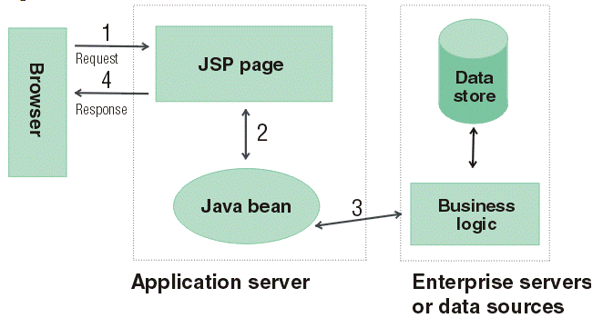

# MVC(Model-View-Controller)
제록스 연구소에서 일하던 트뤼그베 린즈커그가 처음으로 소개한 개념으로, 데스크톱Desktop 어플리케이션용으로 고안되었다.

### Model
- 모델은 **뷰가 렌더링하는데 필요한 데이터**이다.
    - 예를 들면, 사용자가 요청한 상품 목록이나, 주문 내역이 이에 해당한다.

### View
- 웹 애플리케이션에서 뷰(View)는 **실제로 보이는 부분**이며, 모델을 사용해 렌더링을 한다.
- 뷰는 JSP, JSF, PDF, XML등으로 결과를 표현한다.

### Controller
- 컨트롤러는 **사용자의 액션에 응답하는 컴포넌트**다.
- 컨트롤러는 모델을 업데이트하고, 다른 액션들을 수행한다.

## MVC Model1 아키텍쳐
- MVC 모델 1

- 브라우저의 요청을 개별 JSP가 받는다. 즉, **요청의 수만큼 JSP 페이지가 존재하는 구조**다.
- JSP는 Java bean 클래스(JDBC를 활용하는 DAO 클래스와 유사)를 이용해서 데이터베이스에 접근하고, 결과를 화면에 출력한다.
- JSP에 Java와 HTML 코드가 뒤섞여 유지보수가 어렵다는 단점이 발생한다.

## MVC Model2 아키텍쳐

### 기본
- MVC 모델 2

- 브라우저의 요청을 **서블릿**이 받는다.
- 서블릿이 Java bean을 이용해 DB에 접근하고 결과를 JSP를 통해서 화면에 출력한다.
- **서블릿**은 요청과 데이터를 처리하는 **컨트롤러**의 역할을 수행하고, **JSP**는 모델의 결과를 보여주는 **View**의 역할을 한다.
    - 즉, **로직과 뷰의 분리**가 가능하다.

### 발전형태
- MVC 모델 2 발전형태 (현재)

- 클라이언트가 보내는 **모든 요청을 프론트 컨트롤러라 불리는 하나의 서블릿**이 모두 받는다.
    - 요청을 받을 뿐, 실제 처리는 수행하지 않는다.
    - 서블릿은 관련 요청을 처리하기에 조금 불편한 구조를 가지므로, **실제 처리 로직은 컨트롤러 클래스 혹은 핸들러 클래스에 위임**한다.
- **관련된 URL 요청을 하나의 컨트롤러 클래스에서 처리하도록 구조화**한다.
- **컨트롤러 클래스는 Java bean을 이용해 결과**를 만들고, 이 **결과를 모델에 담아서 프론트 컨트롤러에게 다시 전달**한다.
- **프론트 컨트롤러는 알맞은 뷰View에 모델을 전달해서 그 결과를 출력**하도록 한다.

# Spring Web Module
- Spring Framework

- 발전된 Model 2 MVC 패턴을 지원하는 **Spring Web Module**
    - 이러한 Web Module을 보통 Spring MVC 라고 한다.

### 출처)
- 부스트코스 풀스택 강의 
  - [https://www.boostcourse.org/web316/lecture/16762?isDesc=false](https://www.boostcourse.org/web316/lecture/16762?isDesc=false)